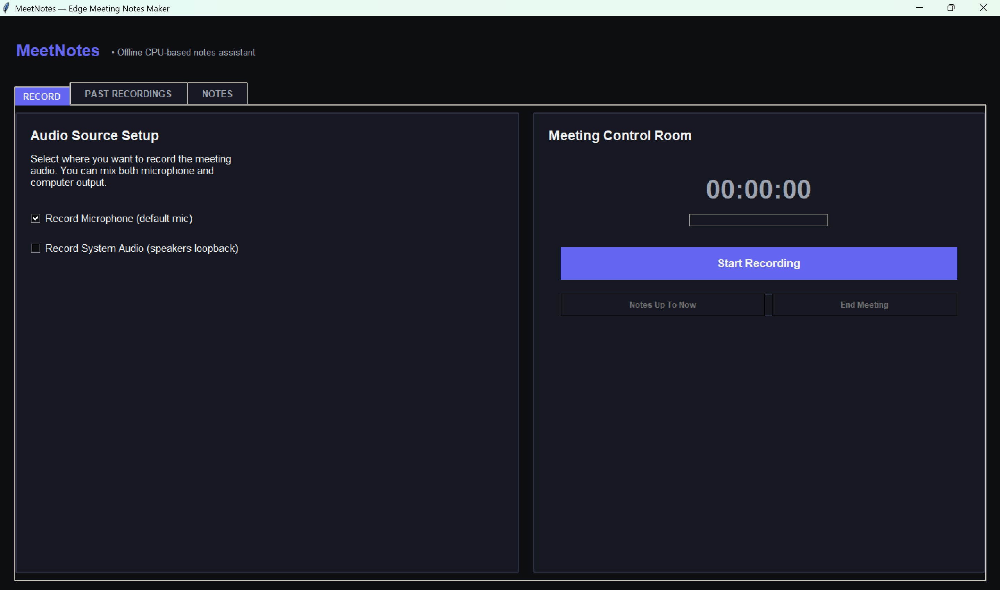
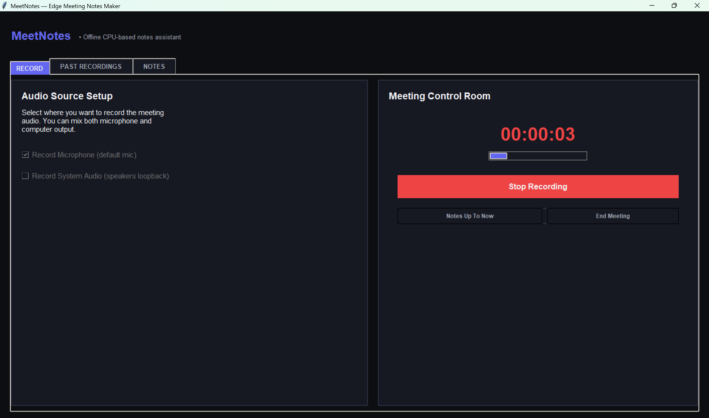
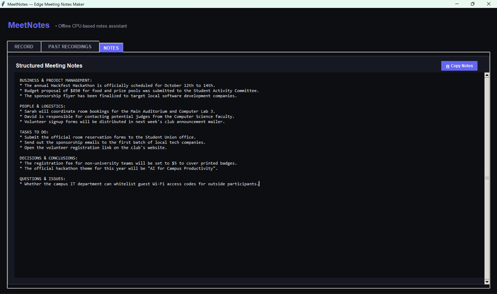
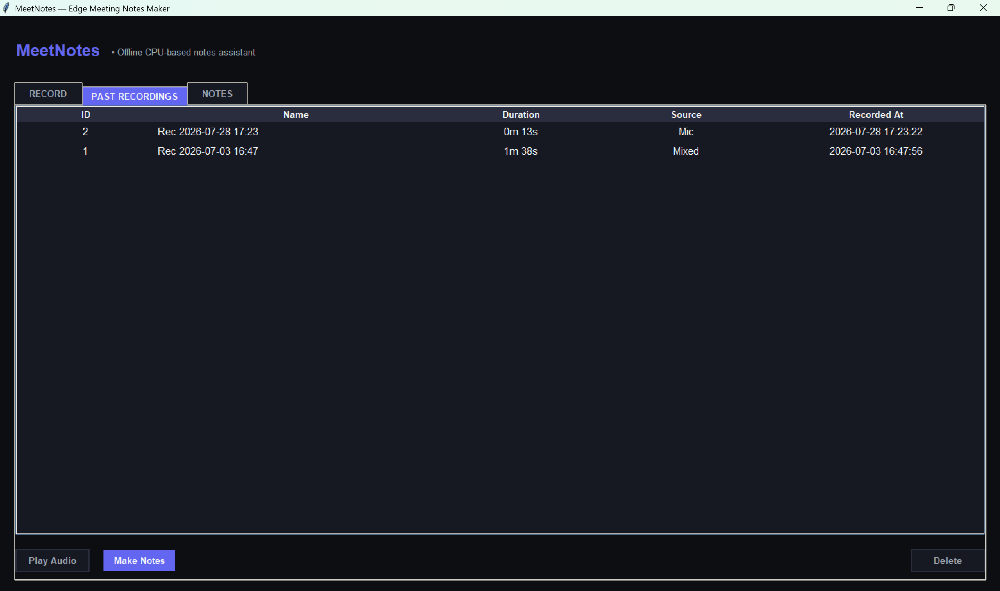

<div align="center">

# 🎙️ MeetNotes
### Privacy-First Offline AI Meeting Assistant


**No cloud. No subscription. No data leaves your machine.**

Record your meetings and get AI-generated, structured notes in seconds — entirely on-device, CPU-only, zero config for end users.

---

<!-- SCREENSHOT PLACEHOLDER 1 -->


</div>

---

## ✨ What It Does

MeetNotes turns any spoken meeting into structured, professional notes — with no internet connection, no API keys, and no model downloads at runtime (after first setup). It is designed for NDA-sensitive environments where data cannot leave the machine.

**Key capabilities:**
- 🎤 **Live audio capture** — microphone, system audio (speaker loopback), or both simultaneously
- 🧠 **On-device ASR** — Moonshine Tiny (27M params, ONNX Runtime, <200ms latency on commodity CPUs)
- 📚 **Semantic chunking** — cosine-similarity topic-boundary detection via `potion-mxbai-256d-v2` embeddings, so the LLM handles coherent topic blocks instead of arbitrary cuts
- 📝 **Structured notes** — fine-tuned SmolLM2-135M running via `llama.cpp` locally, producing notes under consistent headings
- 💾 **Session history** — SQLite database stores all recordings and generated notes; revisit any past meeting
- 🔒 **100% private** — no cloud, no telemetry, no external requests after first-time model setup

---

## 🏗️ Architecture

The pipeline is three sequential stages, all running locally:

```
Audio Input (WAV)
      │
      ▼
┌─────────────────────────────────────────────┐
│  Stage 1 — ASR  (asr.py)                   │
│  Moonshine Tiny ONNX  ·  <200ms/chunk       │
│  30-second chunked processing               │
└───────────────────┬─────────────────────────┘
                    │  raw transcript (text)
                    ▼
┌─────────────────────────────────────────────┐
│  Stage 2 — Semantic Chunker  (chunker.py)  │
│  potion-mxbai-256d-v2 embeddings            │
│  Cosine-similarity boundary detection       │
│  Merge / split / discard post-processing    │
└───────────────────┬─────────────────────────┘
                    │  semantically coherent chunks
                    ▼
┌─────────────────────────────────────────────┐
│  Stage 3 — LLM Notes  (llm.py)             │
│  SmolLM2-135M-Instruct fine-tuned GGUF      │
│  llama-server  ·  OpenAI-compatible API     │
│  CPU-only  ·  6-bit quantized               │
└───────────────────┬─────────────────────────┘
                    │  structured notes (text)
                    ▼
         SQLite DB  +  notes/ folder
```

---

## 🤖 Model Details

### ASR — Moonshine Tiny ORT
| Property | Value |
|---|---|
| Architecture | Moonshine (encoder-decoder) |
| Parameters | 27M |
| Runtime | ONNX Runtime (no PyTorch required) |
| Latency | <200ms per 30-second audio chunk |
| Format | `models/moonshine_tiny_ort/` |

### Embedding — potion-mxbai-256d-v2
| Property | Value |
|---|---|
| Type | Static embedding model (model2vec) |
| Dimensions | 256 |
| Purpose | Cosine-similarity topic boundary detection |
| Format | `models/potion-mxbai-256d-v2/` |

### LLM — SmolLM2-135M Fine-tuned
| Property | Value |
|---|---|
| Base model | SmolLM2-135M-Instruct |
| Fine-tuning | LoRA (r=16, 3 epochs) on 5,000+ AMI/ICSI meeting pairs |
| Training data | Synthesized via LLM distillation from 172hr AMI/ICSI corpus |
| Quantization | 6-bit GGUF (UD-Q5_K_XL), **67% size reduction** vs base Q8 |
| Runtime | llama.cpp (`llama-server.exe`) — CPU-only, zero GPU dependency |
| Download | 🤗 **[Download from Hugging Face](https://huggingface.co/saubhagyaraj/SmolLM2-135M-Meetnotes-gguf-Q8.gguf)** |

---

## 📸 App Screenshots

<!-- SCREENSHOT PLACEHOLDER 2 -->


<!-- SCREENSHOT PLACEHOLDER 3 -->


<!-- SCREENSHOT PLACEHOLDER 4 -->


---

## 🗂️ Project Structure

```
MeetNotes/
│
├── src/                          # Application source
│   ├── main.py                   # Entry point: checks llama-server + GGUF, launches GUI
│   ├── gui/
│   │   ├── app.py                # Main Tkinter UI (Record / Past Recordings / Notes tabs)
│   │   ├── recorder.py           # Audio capture (mic + system loopback)
│   │   └── styles.py             # Dark-theme design tokens
│   ├── pipeline/
│   │   ├── asr.py                # Moonshine Tiny ASR wrapper
│   │   ├── chunker.py            # Semantic transcript chunker
│   │   ├── llm.py                # LlamaServerManager (llama-server subprocess + API)
│   │   └── notes_pipeline.py     # Orchestrates all three stages
│   └── storage/
│       └── db.py                 # SQLite session storage
│
├── models/                       # On-device models (populated by setup.py)
│   ├── moonshine_tiny_ort/       # Moonshine Tiny ONNX Runtime files
│   ├── potion-mxbai-256d-v2/     # Embedding model
│   └── SmolLM2-135M-Meetnotes-gguf-Q8.gguf   # Fine-tuned SmolLM2 (download from HuggingFace)
│
├── bin/                          # Place llama-server.exe here
│   └── llama-server.exe          # (not included — see Getting Started)
│
├── Training and Experimentation/ # Full ML training pipeline
│   ├── SmolLM2_135M_MeetNotes_Finetuning.ipynb   # LoRA fine-tuning notebook (Unsloth)
│   └── data_prep/
│       ├── step1_transcribe_datasets.py  # AMI/ICSI audio → transcripts
│       ├── step2_chunk_transcripts.py    # Transcript segmentation
│       ├── step3_generate_targets.py     # LLM distillation → (transcript, notes) pairs
│       └── step4_build_dataset.py        # Assemble final train/val JSONL
│
├── recordings/                   # WAV recordings saved here (gitignored)
├── notes/                        # Generated notes saved here (gitignored)
├── assets/                       # App icon and screenshots
├── setup.py                      # First-run model download script
├── requirements.txt              # Python dependencies
├── build.bat                     # PyInstaller compiler script
└── build.spec                    # PyInstaller packaging config
```

---

## 🚀 Getting Started (Developer Mode)

### Prerequisites

| Requirement | Notes |
|---|---|
| Python 3.10+ | Tested on 3.11 |
| Windows 10/11 | GUI uses Tkinter; audio capture uses soundcard/WASAPI |
| `llama-server.exe` | From [llama.cpp Releases](https://github.com/ggerganov/llama.cpp/releases) — download a Windows CPU build |
| Fine-tuned GGUF | From [Hugging Face](https://huggingface.co/saubhagyaraj/SmolLM2-135M-Meetnotes-gguf-Q8.gguf) |

### Step-by-step

**1. Clone the repo**
```bash
git clone https://github.com/Chhayaonly/MeetNotes.git
cd MeetNotes
```

**2. Install Python dependencies**
```bash
pip install -r requirements.txt
```

**3. Download on-device models (Moonshine + Embeddings)**
```bash
python setup.py
```
This caches both lightweight models into `models/` — internet access needed only this once.

**4. Get the fine-tuned SmolLM2 GGUF**

Download `SmolLM2-135M-Meetnotes-gguf-Q8.gguf` from:  
🤗 **[Hugging Face Model Page](https://huggingface.co/saubhagyaraj/SmolLM2-135M-Meetnotes-gguf-Q8.gguf)**

Place it in:
```
models/SmolLM2-135M-Meetnotes-gguf-Q8.gguf
```

**5. Get `llama-server.exe`**

Download a Windows CPU release of llama.cpp from:  
🔗 https://github.com/ggerganov/llama.cpp/releases

Place the binary at:
```
bin/llama-server.exe
```

Or set the `LLAMA_SERVER_PATH` environment variable to its full path.

**6. Run the app**
```bash
python src/main.py
```

---

## 🪟 Windows Installer

> **⚠️ Coming Soon** — The packaged Windows installer (no Python required, ~220MB, zero-config) is being prepared and will be available as a [GitHub Release](https://github.com/Chhayaonly/MeetNotes/releases) soon.

---

## 🏋️ Training Pipeline

The fine-tuned SmolLM2-135M was trained on a **custom dataset synthesized entirely from real academic meeting corpora** using LLM distillation. Every (transcript, notes) pair in the training data was generated by a large teacher model, not written by hand.

### Step 1 — Transcription (`step1_transcribe_datasets.py`)

The raw source material is the **AMI** and **ICSI** corpora — 172 hours of real, multi-speaker meeting audio with word-level ground-truth transcripts. The script reads these transcripts, cleans and normalises them, producing a single `transcripts.json` with all meeting text.

A Colab variant (`step1_colab_transcribe.py`) uses Moonshine to re-transcribe from audio, matching the exact ASR output format the production pipeline will see — making the training data realistically noisy.

### Step 2 — Semantic Chunking (`step2_chunk_transcripts.py`)

Each full meeting transcript is run through the same `SemanticChunker` used in production, producing `chunks.json` — a list of semantically coherent 300–600 word blocks. Training on these ensures the LLM learns from the exact input distribution it will face at inference time.

### Step 3 — LLM Distillation via Gemini API (`step3_generate_targets.py`)

This is the core data generation step. Each transcript chunk is sent to **Gemma 4 31B** (accessed via the **Google Gemini API**) as a teacher model to generate high-quality structured meeting notes.

Key design decisions:
- **Batched API calls** (10 chunks/batch) with exponential-backoff retry for rate limits and transient errors
- **Strict output validation**: every generated note must have ALL-CAPS headings, `*` bullet points, no markdown (`**`, `#`), no preamble junk (`"Here is..."`, `"Certainly..."`)
- **Faithfulness enforcement** in the system prompt: proposals stay proposals, only confirmed decisions are stated as decisions
- **Progressive saving** after each batch — the 5,000+ pair generation run is resumable
- **Random chunk shuffling** before batching to prevent consecutive meeting chunks from attending to each other across batch boundaries

Rejected outputs are logged to `output/rejected_chunks.log` for inspection.

### Step 4 — Dataset Assembly (`step4_build_dataset.py`)

Validated pairs are formatted into SmolLM2-Instruct's **ChatML** format and split 90/10 into `train.jsonl` / `val.jsonl`.

### Fine-tuning (`SmolLM2_135M_MeetNotes_Finetuning.ipynb`)

| Setting | Value |
|---|---|
| Framework | Unsloth + TRL `SFTTrainer` |
| Method | LoRA, r=16, lora_alpha=32, all attention+MLP projections |
| Loss masking | `train_on_responses_only` — model learns notes only, not the prompt |
| Epochs | 3, cosine LR schedule |
| Batch | 2 per device × 8 gradient accumulation steps |
| Quantization | UD-Q5_K_XL GGUF export → **67% smaller** than Q8 base |
| Runtime | llama.cpp `llama-server`, OpenAI-compatible REST API, CPU-only |

The training notebook is fully annotated, including rationale for every non-default hyperparameter choice.

---

## 🔒 Privacy by Design

| What others do | What MeetNotes does |
|---|---|
| Send audio to cloud API | All audio stays on device |
| Require GPU or paid tier | Runs on any Windows CPU |
| Mandate login / account | Zero config, no accounts |
| Log meeting content | SQLite stored locally only |

Designed for NDA-sensitive corporate environments where meeting content cannot leave the endpoint.

---

## 📄 License

MIT — see [LICENSE](LICENSE) for details.

---

<div align="center">
Built with ❤️ | <a href="https://github.com/Chhayaonly/MeetNotes">GitHub</a>
</div>
